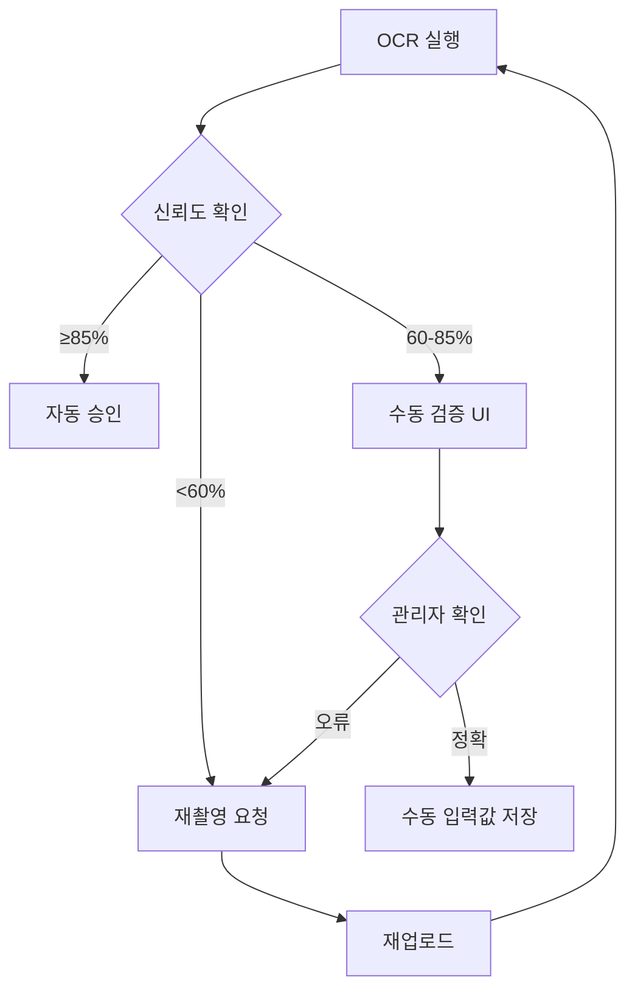

# 공정한 평가를 위한 가이드라인

## 목적
이 문서는 기업 지원 사업 평가의 공정성, 투명성, 일관성을 보장하기 위한 핵심 원칙과 구현 가이드를 제공합니다.

## 1. 평가 공정성 원칙

### 1.1 익명성 보장
- **심사위원 배정**: 이해관계가 없는 심사위원만 배정
- **블라인드 평가**: 기업명 마스킹 옵션 제공 (필요 시)
- **순차 평가**: 타 심사위원의 점수는 최종 제출 전까지 비공개

### 1.2 평가 항목 표준화
모든 평가 항목은 다음 요소를 포함해야 합니다:
- **항목명**: 명확하고 구체적인 이름
- **배점**: 최대 점수 명시
- **가중치**: 전체 항목 가중치 합계 = 100%
- **평가 기준**: 점수대별 상세 기준 제공

### 1.3 일관성 유지
- **평가표 템플릿**: 사업별 동일한 양식 사용
- **시간 제한**: 서류 평가 시간 가이드라인 제시 (예: 기업당 30분)
- **교육**: 심사위원 사전 교육 자료 제공

## 2. 점수 계산 방법론

### 2.1 최고/최저점 제외 평균 (Trimmed Mean)

#### 적용 조건
- 심사위원 **5인 이상**인 경우
- 최고점 1개, 최저점 1개 자동 제외
- 나머지 점수의 평균을 최종 점수로 산정

#### 수학적 정의
```
평가자 수 < 5: 단순 평균
평가자 수 ≥ 5: Trimmed Mean (최고/최저 1개씩 제외)

최종 점수 = Σ(제외 후 점수) / (n - 2)
```

#### 예시
```
심사위원 점수: [60, 85, 88, 90, 95]

단순 평균: (60 + 85 + 88 + 90 + 95) / 5 = 83.6
Trimmed Mean: (85 + 88 + 90) / 3 = 87.67 ✓

→ 87.67점 채택 (극단값 60, 95 제외)
```

### 2.2 가중치 적용

#### 설정 예시
| 항목         | 배점 | 가중치 |
|--------------|------|--------|
| 기술 혁신성  | 100  | 40%    |
| 사업 타당성  | 100  | 30%    |
| 시장성       | 100  | 20%    |
| 팀 역량      | 100  | 10%    |
| **합계**     |      | **100%** |

#### 계산 공식
```
최종 점수 = (기술혁신성 × 0.4) + (사업타당성 × 0.3) + (시장성 × 0.2) + (팀역량 × 0.1)
```

#### 예시
```
심사위원 A의 평가:
- 기술 혁신성: 85점
- 사업 타당성: 90점
- 시장성: 88점
- 팀 역량: 82점

가중 점수 = (85 × 0.4) + (90 × 0.3) + (88 × 0.2) + (82 × 0.1)
         = 34 + 27 + 17.6 + 8.2
         = 86.8점
```

### 2.3 반올림 규칙
- **소수점 둘째 자리**까지 표시
- **셋째 자리**에서 반올림 (Banker's Rounding)
- 예: 87.675 → 87.68

## 3. 이상치 탐지 및 처리

### 3.1 이상치 정의
다음 조건을 만족하는 점수를 이상치로 간주:
- **IQR 방식**: Q1 - 1.5×IQR 미만 또는 Q3 + 1.5×IQR 초과
- **표준편차 방식**: 평균 ± 2σ 범위 밖

### 3.2 이상치 발견 시 조치
1. **자동 경고**: 시스템에서 관리자에게 알림
2. **사유 확인**: 해당 심사위원에게 평가 사유 문의
3. **재평가 여부**: 명백한 오류 시 재평가 요청
4. **기록 보존**: 모든 이상치 및 조치 내역 Audit Log 저장

### 3.3 구현 예시
```python
# scripts/calculator.py의 detect_outliers() 활용
outlier_result = ScoreCalculator.detect_outliers([60, 85, 88, 90, 95])
# {'outliers': [60], 'lower_bound': 77.5, 'upper_bound': 97.5}

if outlier_result['outliers']:
    notify_admin(f"이상치 발견: {outlier_result['outliers']}")
```

## 4. OCR 품질 기준

### 4.1 필수 추출 항목 (사업자등록증)
- [ ] 사업자등록번호 (정확도 **100%** 필수)
- [ ] 상호명 (정확도 **95%** 이상)
- [ ] 대표자명 (정확도 **90%** 이상)
- [ ] 사업장 주소 (정확도 **85%** 이상)

### 4.2 신뢰도 임계값
- **자동 승인**: 신뢰도 ≥ 85%
- **수동 검증**: 신뢰도 < 85%
- **재촬영 요청**: 신뢰도 < 60%

### 4.3 이미지 품질 기준
| 항목       | 최소 기준        | 권장 기준        |
|------------|------------------|------------------|
| 해상도     | 200 DPI          | 300 DPI 이상     |
| 파일 크기  | 100 KB           | 500 KB ~ 2 MB    |
| 포맷       | JPG, PNG         | PNG (무손실)     |
| 색상       | 그레이스케일     | 흑백 대비 조정   |
| 기울기     | ±5도 이내        | 0도 (정렬 완료)  |

### 4.4 OCR 실패 시 대응


## 5. 평가 프로세스 체크리스트

### 5.1 평가 시작 전
- [ ] 심사위원 사전 교육 완료
- [ ] 평가 항목 및 배점 공지
- [ ] 이해관계 충돌 확인
- [ ] 시스템 접근 권한 부여

### 5.2 평가 진행 중
- [ ] Auto-save 기능 작동 확인 (3-5초 간격)
- [ ] PDF 뷰어 정상 로딩
- [ ] 임시 저장 데이터 보존
- [ ] 제출 전 재검토 안내 메시지

### 5.3 평가 제출 후
- [ ] 전자서명 이미지 저장
- [ ] `is_submitted=True` 플래그 설정
- [ ] 데이터 읽기 전용 전환
- [ ] Audit Log 기록
- [ ] 심사위원에게 제출 완료 알림

### 5.4 점수 집계
- [ ] 모든 심사위원 제출 완료 확인
- [ ] Trimmed Mean 자동 계산
- [ ] 가중치 적용
- [ ] 이상치 검토
- [ ] 최종 점수표 PDF 생성

## 6. 보안 및 윤리

### 6.1 데이터 접근 제어
- **관리자**: 모든 데이터 읽기/쓰기
- **심사위원**: 본인 평가 데이터만 읽기/쓰기
- **기업**: 자사 최종 결과만 조회 (평가 완료 후)

### 6.2 감사 추적
다음 행위는 반드시 Audit Log에 기록:
- 평가 데이터 생성/수정/제출
- 관리자의 데이터 조회
- 점수 재계산
- 이상치 조치

### 6.3 윤리 규정
- **금전적 이해관계**: 심사위원은 평가 기업과 금전적 관계 금지
- **정보 유출**: 평가 중 취득한 기업 정보 외부 공유 금지
- **공정성 훼손**: 특정 기업 우대/차별 시 평가 무효

## 7. 품질 보증 (QA) 체크리스트

### 7.1 기능 테스트
- [ ] 점수 계산 로직 단위 테스트 (pytest)
- [ ] OCR 정확도 샘플 테스트 (최소 100건)
- [ ] Auto-save 동작 검증
- [ ] PDF 렌더링 브라우저 호환성

### 7.2 성능 테스트
- [ ] 동시 접속 100명 부하 테스트
- [ ] PDF 파일 10MB 업로드 시간 < 5초
- [ ] OCR 처리 시간 < 30초
- [ ] 점수 집계 시간 (100개 기업) < 10초

### 7.3 보안 테스트
- [ ] SQL Injection 방어
- [ ] XSS 공격 방어
- [ ] CSRF 토큰 검증
- [ ] 권한 우회 시도 차단

## 8. FAQ

### Q1. 심사위원이 4명인데 Trimmed Mean을 적용할 수 있나요?
**A**: 아니요. 5인 미만인 경우 단순 평균을 사용합니다. 4명이면 모든 점수를 합산하여 4로 나눕니다.

### Q2. 가중치 합계가 100%가 아니면 어떻게 되나요?
**A**: 시스템에서 자동으로 정규화합니다. 예를 들어, 가중치가 [0.3, 0.4, 0.2]이면 합계가 0.9이므로 각각 0.333, 0.444, 0.222로 조정됩니다.

### Q3. OCR 신뢰도가 낮은데 강제로 승인할 수 있나요?
**A**: 관리자 권한으로 가능하지만, 수동 검증 후 정확한 값을 입력해야 하며 모든 조치는 Audit Log에 기록됩니다.

### Q4. 제출 완료 후 점수를 수정해야 하는 경우는?
**A**: `is_submitted=True` 후에는 일반 수정이 불가능합니다. 관리자 권한으로 특별 승인 후 수정 가능하며, 사유와 수정 내역이 Audit Log에 기록됩니다.

### Q5. 이상치로 판단된 점수는 자동으로 제외되나요?
**A**: 아니요. 이상치 탐지는 경고 목적이며, 실제 제외는 관리자의 검토 후 결정됩니다. Trimmed Mean은 이상치 여부와 무관하게 최고/최저 1개씩만 제외합니다.

## 9. 개정 이력

| 버전  | 날짜       | 변경 내용                          | 작성자 |
|-------|------------|------------------------------------|--------|
| 1.0   | 2026-01-09 | 초안 작성                          | System |

## 10. 관련 문서

- `references/security_standard.md` - 보안 표준
- `scripts/calculator.py` - 점수 계산 구현
- `scripts/ocr_parser.py` - OCR 파싱 구현
- `templates/prd_template.md` - 제품 요구사항 템플릿

---

**이 가이드라인은 평가 시스템의 핵심 원칙을 담고 있습니다. 모든 개발과 운영은 이 문서를 기준으로 진행되어야 합니다.**
