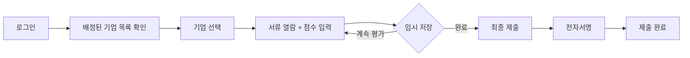

# 제품 요구사항 문서 (Product Requirements Document)

## 문서 정보

| 항목           | 내용                          |
|----------------|-------------------------------|
| 프로젝트명     | [프로젝트명을 입력하세요]     |
| 작성자         | [작성자명]                    |
| 작성일         | [YYYY-MM-DD]                  |
| 버전           | 1.0                           |
| 상태           | [ ] 초안 / [ ] 검토 중 / [ ] 승인 |

---

## 1. 프로젝트 개요

### 1.1 배경 및 목적
**현재 문제점**:
- [기존 프로세스의 어떤 문제를 해결하고자 하는가?]
- 예: 수작업 평가로 인한 시간 낭비, 공정성 논란, 데이터 분실 위험 등

**해결 방안**:
- [이 시스템이 어떻게 문제를 해결할 것인가?]
- 예: 디지털화된 평가 프로세스, 자동 점수 계산, 감사 추적 기능

**기대 효과**:
- [ ] 평가 시간 단축: [현재 X시간 → 목표 Y시간]
- [ ] 공정성 향상: 최고/최저점 제외 평균 적용
- [ ] 데이터 무결성: 제출 후 수정 불가, 감사 로그 기록
- [ ] 비용 절감: [예상 절감액 또는 비율]

### 1.2 프로젝트 범위

#### MVP (Minimum Viable Product) 포함 기능
1. **관리자 기능**
   - [ ] 사업 생성 및 관리
   - [ ] 기업 서류 업로드
   - [ ] 심사위원 배정
   - [ ] 최종 결과 집계 및 리포트 출력

2. **심사위원 기능**
   - [ ] 배정된 기업 서류 열람 (PDF 뷰어)
   - [ ] 평가 항목별 점수 입력
   - [ ] 종합 의견 작성
   - [ ] 전자서명 제출

3. **공통 기능**
   - [ ] 로그인/로그아웃
   - [ ] 역할별 접근 제어
   - [ ] Auto-save (임시 저장)

4. **자동화 기능**
   - [ ] OCR 서류 검증 (사업자등록증)
   - [ ] 점수 자동 계산 (가중치 적용)
   - [ ] 평가 리포트 PDF 생성

#### MVP 제외 기능 (Phase 2 이후)
- [ ] 이메일 알림
- [ ] 모바일 앱
- [ ] 대시보드 차트 (고급 통계)
- [ ] 다국어 지원

### 1.3 성공 지표 (KPI)

| 지표                     | 현재 (As-Is) | 목표 (To-Be) |
|--------------------------|--------------|--------------|
| 평가 완료 시간           | [예: 3일]    | [예: 1일]    |
| 평가 데이터 오류율       | [예: 5%]     | [예: <1%]    |
| 심사위원 만족도          | [예: 60점]   | [예: 85점]   |
| 시스템 가동률 (Uptime)   | -            | 99.5% 이상   |

---

## 2. 사용자 정의

### 2.1 주요 사용자 역할 (User Personas)

#### 관리자 (사무국 담당자)
- **역할**: 사업 전체 관리, 심사 조율
- **기술 수준**: 중급 (Office 프로그램 능숙)
- **목표**:
  - 평가 프로세스를 효율적으로 관리
  - 공정성 논란 최소화
  - 최종 결과 신속하게 도출
- **Pain Points**:
  - 엑셀 수작업으로 점수 집계 시 오류 발생
  - 심사위원별 평가 진행 상황 파악 어려움

#### 심사위원
- **역할**: 기업 서류 검토 및 평가
- **기술 수준**: 초급~중급 (IT 활용 능력 다양)
- **목표**:
  - 빠르고 정확하게 평가 완료
  - 과거 평가 이력 참고
- **Pain Points**:
  - PDF 파일 여러 개를 왔다갔다 확인하며 평가
  - 점수 입력 후 저장 깜빡하여 재작성

#### 일반 사용자 (기업 담당자)
- **역할**: 자사 평가 결과 조회 (선택 사항)
- **기술 수준**: 초급
- **목표**: 평가 결과 확인
- **Pain Points**: -

### 2.2 사용자 여정 (User Journey)

#### 심사위원의 평가 프로세스


---

## 3. 핵심 기능 명세

### 3.1 OCR 서류 검증

**기능 설명**:
사업자등록증, 법인등기부등본 등 기업 서류를 업로드하면 Tesseract OCR로 핵심 데이터를 자동 추출합니다.

**입력**:
- 파일 형식: PDF, JPG, PNG
- 최대 크기: 10MB

**출력**:
```json
{
  "사업자등록번호": "123-45-67890",
  "상호": "(주)테크이노베이션",
  "대표자": "홍길동",
  "사업장주소": "서울특별시 강남구 테헤란로 123",
  "신뢰도": 0.92,
  "수동검증필요": false
}
```

**예외 처리**:
- 신뢰도 < 85%: 수동 검증 UI 표시
- OCR 실패: 사용자가 직접 입력

**참고 파일**: `scripts/ocr_parser.py`

---

### 3.2 2분할 평가 UI (Split-View)

**기능 설명**:
화면을 좌우로 나누어 왼쪽에는 PDF 뷰어, 오른쪽에는 점수 입력창을 배치합니다.

**레이아웃**:
```
┌──────────────────────┬──────────────────────┐
│                      │  평가 항목           │
│                      │  ┌────────────────┐  │
│  PDF 뷰어            │  │ 기술성: [  85] │  │
│  (서류 열람)         │  │ 사업성: [  90] │  │
│                      │  │ 시장성: [  88] │  │
│  - 확대/축소         │  └────────────────┘  │
│  - 페이지 이동       │                      │
│  - 검색              │  종합 의견:          │
│                      │  [텍스트 입력란]     │
│                      │                      │
│                      │  [임시저장] [제출]   │
└──────────────────────┴──────────────────────┘
```

**기술 스택**:
- Frontend: `react-pdf-viewer`
- 독립 스크롤: 좌우 영역 스크롤 별도 동작

**참고 파일**: `frontend/src/components/evaluator/SplitViewEvaluator.js`

---

### 3.3 Auto-Save (자동 저장)

**기능 설명**:
사용자가 점수를 입력하면 3~5초 후 자동으로 서버에 임시 저장됩니다.

**트리거**:
- 입력 필드 값 변경 시
- Debounce: 3초 (마지막 입력 후 3초 대기)

**상태 표시**:
- "저장 중..." → "저장 완료" → (사라짐)

**구현**:
```javascript
// useAutoSave.js
const useAutoSave = (data, saveFunction, delay = 3000) => {
  useEffect(() => {
    const timer = setTimeout(() => {
      saveFunction(data);
    }, delay);
    return () => clearTimeout(timer);
  }, [data, delay]);
};
```

**참고 파일**: `frontend/src/hooks/useAutoSave.js`

---

### 3.4 점수 계산 로직

**가중치 적용**:
```python
# 예시
항목별_점수 = {"기술성": 85, "사업성": 90, "시장성": 88}
가중치 = {"기술성": 0.4, "사업성": 0.3, "시장성": 0.3}

최종_점수 = (85 × 0.4) + (90 × 0.3) + (88 × 0.3) = 87.4
```

**최고/최저점 제외 평균**:
- 심사위원 **5인 이상**인 경우 적용
- 최고점 1개, 최저점 1개 제외 후 평균

**반올림**:
- 소수점 **둘째 자리**까지 표시
- 셋째 자리에서 반올림

**참고 파일**: `scripts/calculator.py`, `references/eval_guidelines.md`

---

### 3.5 평가 리포트 생성

**출력 형식**: PDF

**포함 내용**:
1. 사업명 및 평가 일시
2. 기업명 및 기본 정보
3. 심사위원별 점수 테이블
4. 최종 점수 (Trimmed Mean)
5. 심사위원 전자서명 이미지

**예시**:
```
========================================
    [사업명] 평가 결과표
========================================

기업명: (주)테크이노베이션
사업자번호: 123-45-67890

----------------------------------------
심사위원       | 기술성 | 사업성 | 최종점수
----------------------------------------
홍길동         |  85   |  90   |  87.4
김철수         |  88   |  92   |  89.6
...
----------------------------------------

최종 점수: 88.5점 (Trimmed Mean)

서명: [이미지]
```

---

## 4. 비기능 요구사항

### 4.1 성능
- [ ] 페이지 로딩 시간: < 3초
- [ ] PDF 렌더링 시간: < 5초 (10MB 기준)
- [ ] OCR 처리 시간: < 30초
- [ ] Auto-save 응답 시간: < 1초
- [ ] 동시 접속자: 100명 지원

### 4.2 보안
- [ ] HTTPS 필수
- [ ] 비밀번호 복잡도 검증 (8자 이상, 영문+숫자+특수문자)
- [ ] 세션 타임아웃: 30분
- [ ] SQL Injection 방어 (ORM 사용)
- [ ] XSS 방어 (출력 인코딩)
- [ ] 제출 완료 데이터 수정 불가

**참고 파일**: `references/security_standard.md`

### 4.3 가용성
- [ ] 시스템 가동률: 99.5% 이상
- [ ] 데이터 백업: 일 1회
- [ ] 장애 복구 시간(RTO): < 4시간

### 4.4 호환성
- [ ] 브라우저: Chrome, Firefox, Safari, Edge (최신 2개 버전)
- [ ] 운영체제: Windows 10+, macOS 11+, Linux
- [ ] 모바일: 태블릿 지원 (10인치 이상)

### 4.5 접근성
- [ ] 폰트 크기 조절 가능
- [ ] 고대비 모드 지원
- [ ] 키보드 내비게이션 지원

---

## 5. 제약사항 및 가정

### 5.1 기술적 제약
- **온프레미스 배포**: 클라우드 서비스 사용 불가
- **오픈소스 우선**: 라이센스 비용 최소화
- **한국어 OCR**: Tesseract KOR 모델 사용

### 5.2 비즈니스 제약
- **예산**: [예산 범위]
- **일정**: [개발 기간, 예: 3개월]
- **인력**: [팀 구성, 예: 개발자 2명, 디자이너 1명]

### 5.3 가정
- 심사위원은 기본적인 컴퓨터 사용 능력 보유
- 네트워크 환경: 유선 LAN 또는 안정적인 Wi-Fi
- 서류는 스캔 또는 사진으로 디지털화 완료

---

## 6. 데이터 요구사항

### 6.1 데이터 모델

#### Projects (사업)
| 필드명        | 타입      | 설명              |
|---------------|-----------|-------------------|
| id            | INTEGER   | PK                |
| name          | VARCHAR   | 사업명            |
| stage         | ENUM      | 서류/발표         |
| status        | ENUM      | 진행중/완료       |
| created_at    | TIMESTAMP | 생성일            |

#### Companies (기업)
| 필드명              | 타입      | 설명              |
|---------------------|-----------|-------------------|
| id                  | INTEGER   | PK                |
| project_id          | INTEGER   | FK (Projects)     |
| name                | VARCHAR   | 기업명            |
| business_number     | VARCHAR   | 사업자번호        |
| documents_path      | TEXT      | 서류 경로         |
| ocr_data            | JSONB     | OCR 추출 데이터   |

#### Evaluations (평가)
| 필드명        | 타입      | 설명              |
|---------------|-----------|-------------------|
| id            | INTEGER   | PK                |
| company_id    | INTEGER   | FK (Companies)    |
| evaluator_id  | INTEGER   | FK (Users)        |
| scores_data   | JSONB     | 평가 점수         |
| is_submitted  | BOOLEAN   | 제출 여부         |
| signature_img | TEXT      | 전자서명 이미지   |
| created_at    | TIMESTAMP | 생성일            |
| updated_at    | TIMESTAMP | 수정일            |

**참고 파일**: `backend/migrations/init.sql`

### 6.2 데이터 보존
- **평가 데이터**: 영구 보존
- **Audit Log**: 최소 3년
- **업로드 파일**: 사업 종료 후 5년

---

## 7. 우선순위

### P0 (필수, MVP 포함)
1. 로그인/권한 관리
2. 기업 서류 업로드
3. 2분할 평가 UI
4. Auto-save
5. 점수 계산 로직
6. 평가 리포트 PDF

### P1 (중요, MVP 포함 가능)
1. OCR 서류 검증
2. 전자서명
3. Audit Log

### P2 (추후 개발)
1. 이메일 알림
2. 대시보드 차트
3. 평가 템플릿 관리

---

## 8. 위험 관리

| 위험 요소                  | 확률 | 영향 | 대응 전략                     |
|----------------------------|------|------|-------------------------------|
| OCR 정확도 낮음            | 중   | 중   | 수동 검증 UI 필수 구현        |
| 동시 접속자 급증           | 저   | 고   | 부하 테스트 및 스케일링 계획  |
| 심사위원 IT 능력 부족      | 중   | 중   | 사전 교육 및 매뉴얼 제공      |
| 보안 취약점 발견           | 저   | 고   | 정기 보안 스캔, 패치 적용     |

---

## 9. 다음 단계

- [ ] PRD 검토 및 승인
- [ ] 기술 설계 문서(TRD) 작성
- [ ] UI/UX 목업 제작
- [ ] 개발 착수

---

## 10. 참고 자료

- `templates/trd_template.md` - 기술 설계 문서
- `references/eval_guidelines.md` - 평가 가이드라인
- `references/security_standard.md` - 보안 표준

---

**문서 승인**

| 역할       | 이름 | 서명 | 날짜 |
|------------|------|------|------|
| 제품 책임자|      |      |      |
| 기술 책임자|      |      |      |
| 프로젝트 관리자|  |      |      |
